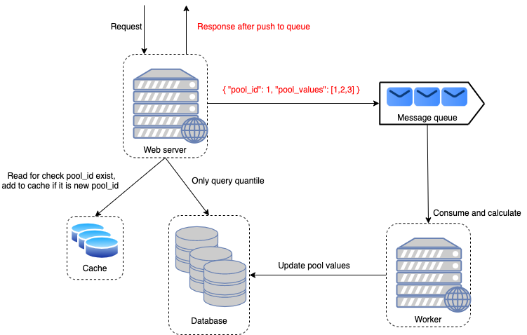

# POOL

<h2 align="center">Just a little and funny project</h2>

[Problem](./docs/problem.txt)

To run this project, please run command in your terminal (require install `Docker`):

```sh
docker-compose -f ./build/docker-compose.yml up --build
```

and boom, your app is running now.

We can run APIs example here: [Postman APIs Collection](docs/tcb_assignment.postman_collection.json)

Env for application is placed in [development.emv](build/development.env):
```
PORT=8000            // port for serve Rest API
SECRETJWT=secretjwt  // for jwt but we don't yet need authentication at now
POOLTOPIC=addpool    // topic for add values to pool
NUMOFPOOLCONSUMER=1  // number of consumer, scale up consumer help us handle messages in message queue better
VISUALIZE=false      // we can set true to tell app draw red-black-tree on terminal
```

## Technical requirement

This project implement `in-memory`: [cache](internal/pkg/cache/cache.go), [database](internal/storages/pools.go), [message-queue](internal/pkg/message-queue). I simulate them to keep project simple.

An action add a new value to the specific `pool_id` is a operation insert a node to the `Red-Black-Tree` which is associated with this `pool_id`.

[Red-Black-Tree](https://www.geeksforgeeks.org/red-black-tree-set-1-introduction-2/) is a kind of self-balancing binary search tree 
where each node has an extra bit. I store in node the `size` information itself. It helps me find rank of one node more quickly.

Summary about system:

<p align="center"></p>

## Quantile (percentile form) formula

I figure out it on [google.com](https://www.statisticshowto.com/probability-and-statistics/percentiles-rank-range/):
```
- P: percentile
- N: number of values in sorted data set

n = (P/100) x N

- n can be a float number like a.b

quantile is:

q = rank(a) + 0.b*(rank(a+1) - rank(a))
```

## Tesing

I have not yet had unit test in project :(

I use [k6](https://k6.io/) for api testing. Script and result can be found [here](internal/pkg/api-testing).

## Future
- Add unit test
- Implement rate limiting
- ...
